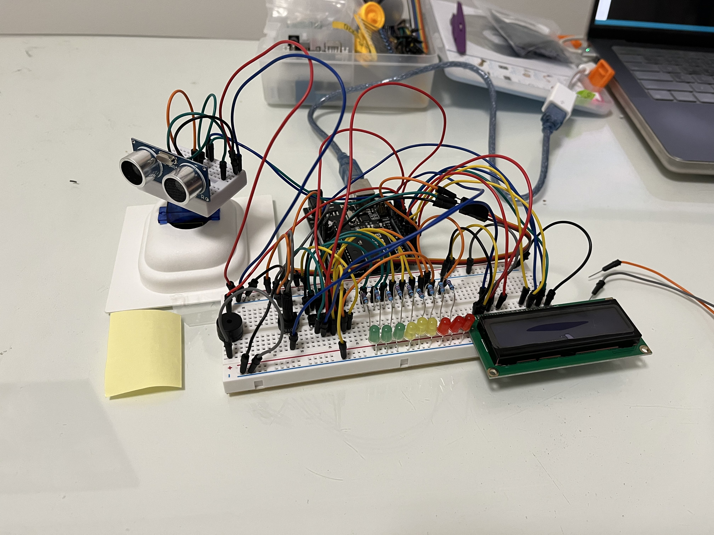
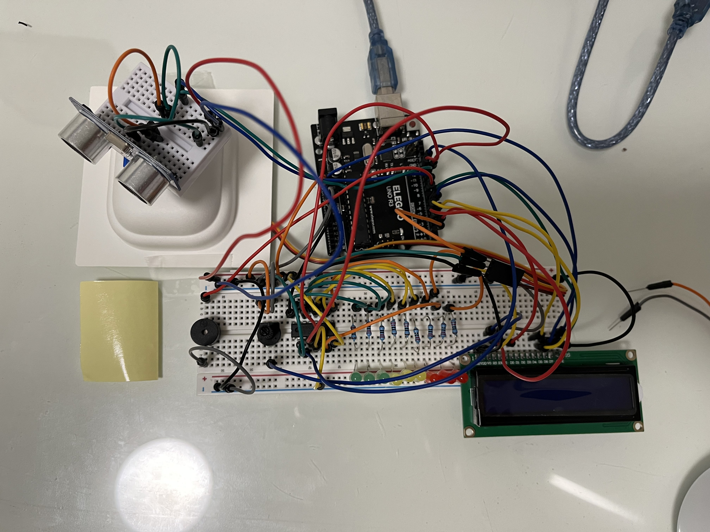
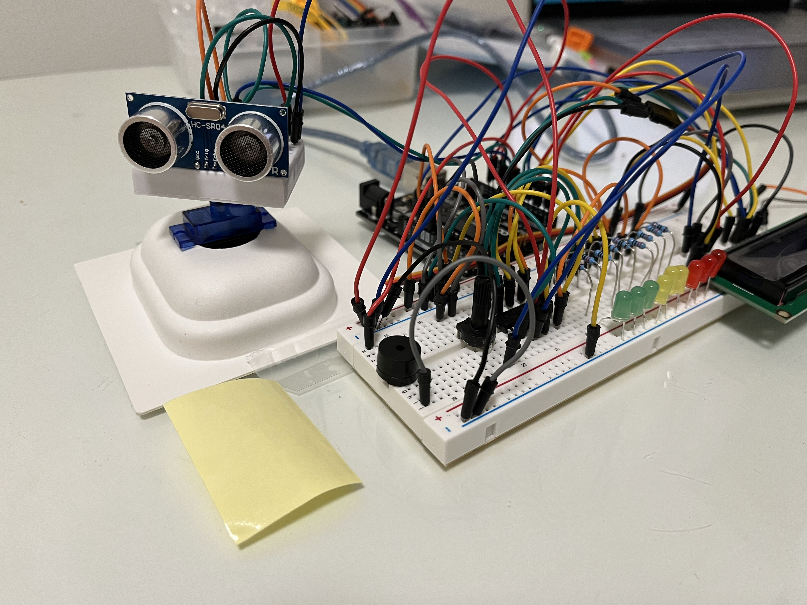

# Ultrasonic Alarm System with Arduino

An Arduino-based security system that uses an ultrasonic sensor, LEDs, servo motor, LCD display, and a buzzer to detect objects in real time. The system rotates to provide 180° protection and triggers visual and audio alarms when an object is detected within range.

---

## 📌 Features

- **Real-time object detection** using the HC-SR04 ultrasonic sensor.
- **180° rotating coverage** with a servo motor for enhanced area protection.
- **Visual feedback** through multiple LEDs controlled by a 74HC595 shift register.
- **Audio alerts** with a buzzer when objects are detected in range.
- **LCD 1602 display** to show distance values and system status.
- **Adjustable contrast** using a potentiometer with the LCD display.

---

## 🛠️ Components Used

- Arduino Uno (Elegoo kit)
- HC-SR04 Ultrasonic Sensor
- Servo Motor (SG90)
- 74HC595 Shift Register (for multiple LEDs)
- LEDs + Resistors
- LCD 1602 Display with Potentiometer
- Buzzer
- Breadboard and Jumper Wires

---

## 💻 How It Works

1. The **HC-SR04 sensor** sends ultrasonic pulses and measures the time taken for the echo to return.
2. The Arduino calculates **precise distance values** from the travel time.
3. The **servo motor rotates up to 180°**, scanning the area.
4. When an object is detected within the defined range:
   - The servo motor **stops rotating**.
   - The **buzzer** sounds an alarm.
   - **LEDs light up** to indicate detection.
   - The **LCD display** shows the distance and system status.

---

## 🚀 Setup and Installation

1. Clone this repository:
   ```bash
   git clone https://github.com/your-username/Ultrasonic-Alarm-System.git
   ```

---

## Images




